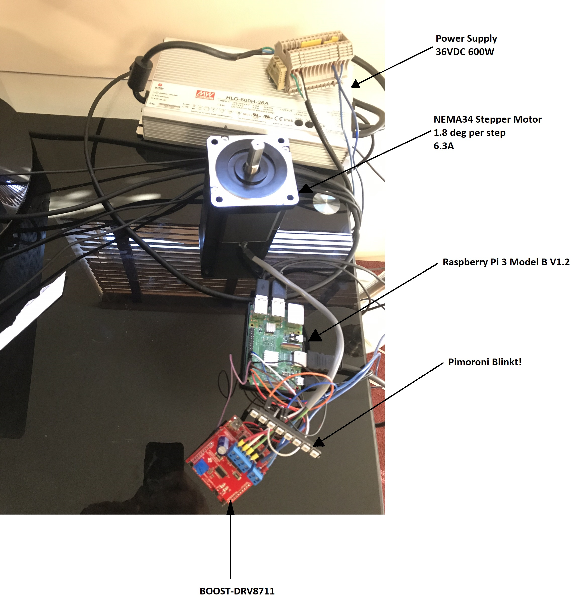
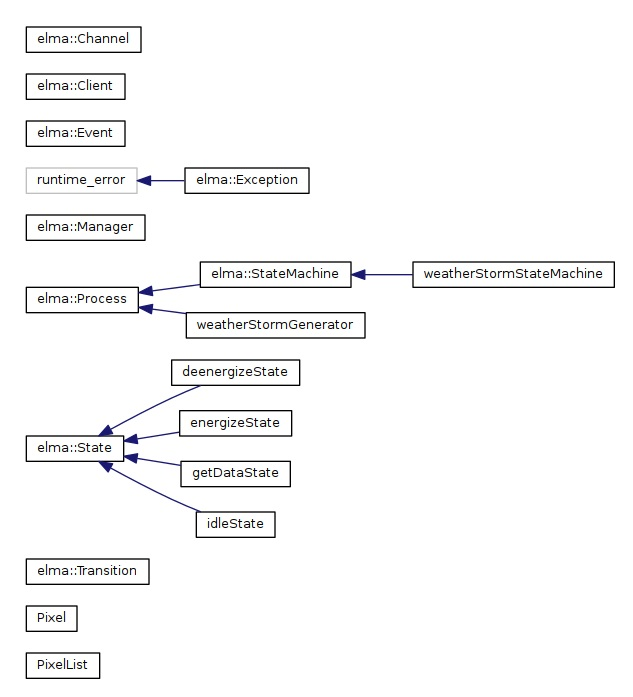
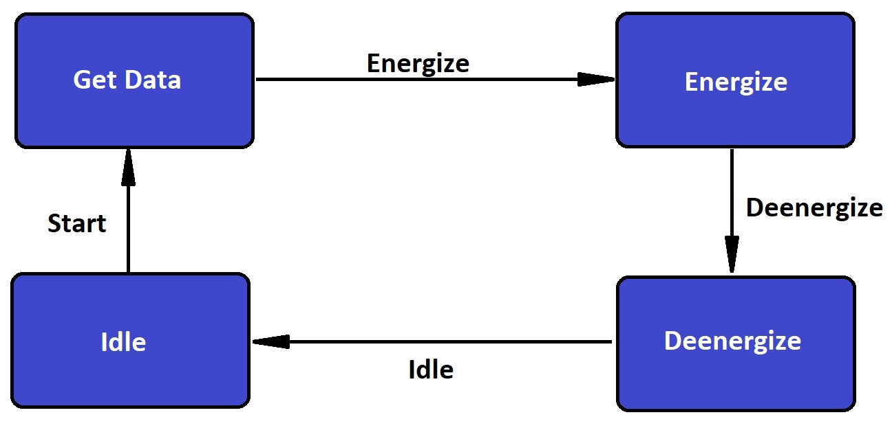

Weather-Storm
===

The Weather-Storm uses the [Elam](https://github.com/klavinslab/elma) library as its infrastructure to implement an event loop process manager for Raspberry Pi to read weather 
data from an online server and use that to create visual indications, such as blinking LEDs and turning a stepper motor. In addition, I am using the [http.h](https://github.com/yhirose/cpp-httplib),
[json.h](https://github.com/nlohmann/json), [bcm2835](https://www.airspayce.com/mikem/bcm2835), [WiringPi](http://wiringpi.com/) for this project. In this project I am getting weather data of Seattle, WA from an online server
[openweathermap](https://api.openweathermap.org/) and using the current maximum temperature of Seattle, I am turning this information into visual responses using the Raspberry Pi. These visual responses are 8 LEDs that brighten while the stepper
motor is rotating as many counts as the current maximum temperature of Seattle in Kelvins and finally, the LEDs dim slowly. I have used a stepper motor, a switching power supply, a TI DRV8711 stepper drive, and a Raspberry Pi for this project.
The source code for this project is available [on github](https://github.com/Pnaghavi/Weather-Storm).
 

Installation on Unix systems (e.g. Raspbian)
---

First install required packages available through apt-get

    sudo apt-get update
    sudo apt-get install -y cmake
    sudo apt-get install -y cppcheck
    sudo apt-get install -y graphviz
    sudo apt-get install -y doxygen
    sudo apt-get install -y cmake
    sudo apt-get install -y libssl-dev

Next, install Google Test

    cd /usr/src
    sudo git clone https://github.com/google/googletest.git
    cd googletest
    sudo mkdir install
    cd install
    sudo cmake ../
    sudo make
    sudo make install

Next, install the json library

    sudo mkdir /usr/local/include/json
    cd /usr/local/include/json
    sudo curl -O -J -L https://github.com/nlohmann/json/releases/download/v3.5.0/json.hpp
    sudo mv json.hpp json.h

Next, install httplib

    cd /tmp
    git clone https://github.com/klavins/cpp-httplib.git
    sudo mkdir /usr/local/include/httplib
    sudo mv /tmp/cpp-httplib/httplib.h /usr/local/include/httplib

Next, install bcm2835
Note: The commands bellow should be run as root 
Use this [link](https://www.airspayce.com/mikem/bcm2835/) to download the latest bcm2835 library  
    
    cd ~
    tar zxvf bcm2835-1.xx.tar.gz
    cd bcm2835-1.xx
    ./configure
    make
    sudo make check
    sudo make install

Now you should be ready to install Weather-Storm:

    cd ~
    mkdir Code
    cd Code
    git clone https://github.com/Pnaghavi/Weather-Storm.git
    cd Weather-Storm
    make

Execution
---
To run the Weather-Storm, type
    
    ./projectSrc/bin/storm

Architecture
---

Below, you can see the electrical setup of my project. All the items are labeled.   

In the current setup the LEDs are controlled directly by the PI, but the stepper drive DRV8711 is not 100% controlled by the PI.
There is a TI Launchpad board under the drive that listens to the PI's pulse train and passes it on to the STEP input of the drive
but the drive requiers SPI com so that the drive registers are setup correctly. On powerup LaunchPad sets all the drive registers. The
drive cannot work without the registers bing set. Raspberry Pi boards are able to run SPI com but after many hours I was not able to make that work

Below, you can see the class hierarchy of the the software. There are four classes inheriting from the abstract State class of Elma. There is a class inheriting from StateMachine class of Elma.
Finally another class inheriting from the the abstarct Process class of Elma 
     

The classes inheriting from State class of Elma are the states of the state machine. The class inheriting from StateMachine in elma constructs the states and adds the transitions of the states.
The class inheriting from process runs the state machine. Currently the process runs through each state and once all tasks on that state is complete, the state machine manager emits the event for the next state.
When the process runs for 100 seconds it constantly runs through all the states of the state machine periodically.           

The diagram below shows the opperation of the state machine. The evil project is made by the evil weather master, that has created an evil state machine. The evil state machine has four stetes idle, get dtat,energize, and deenergize.
In the idle stat the state machine waites for the start event to transition to the get data state. In the get data state the machine sends a get request to the server https://api.openweathermap.org/ to obtain weather date of Seattle.
Once that is complete the state machine will transition to the next state. The next state is the energize state, in this state this evil machine will rotate the stepper motor same numbr of counts as the current maximum temperature of Seattle, while
brightening the LEDs to maximum brightness. Once that task is complete the state machine will trasition to the next state which is deenergize, in this state the LEDs slowly dim until they are off and so this evil machine will deenrgize. Finally,the state machine returns to the idle state.                         

This state machine is run by a process that monitors each state until all tasks are complete before emiting the transition to the next state. In addition it will transfer the json object from the get data state to the energiz and deenergize state.
The main method will run this process for 100 seconds every 7 seconds. The evil state machine will run periodically for 100 seconds until the evil weather master gets bored and moves on to doing somthing worthwile like helping the elderly cross the street.  

Results
---

There is a [video](https://github.com/Pnaghavi/Weather-Storm/blob/master/IMG_2348.mp4) on this repository showing the actual devices running the code.

The example below shows typical output on the terminal when the code is running:  

    Received data from server:

    {
        "base": "stations",
        "clouds": {
            "all": 1
        },
        "cod": 200,
        "coord": {
            "lat": 47.61,
            "lon": -122.33
        },
        "dt": 1553394305,
        "id": 5809844,
        "main": {
            "humidity": 44,
            "pressure": 1022,
            "temp": 285.31,
            "temp_max": 287.15,
            "temp_min": 283.71
        },
        "name": "Seattle",
        "sys": {
            "country": "US",
            "id": 3417,
            "message": 0.0099,
            "sunrise": 1553349980,
            "sunset": 1553394323,
            "type": 1
        },
        "visibility": 16093,
        "weather": [
            {
                "description": "clear sky",
                "icon": "01n",
                "id": 800,
                "main": "Clear"
            }
        ],
        "wind": {
            "deg": 352.502,
            "speed": 1.66
        }
    }
    Seattle's max temperature in Kelvins: 287
    Weather Storm State Machine started.
    Weather Storm State Machine received data.
    Weather Storm State Machine is energized.
    Weather Storm State Machine is deenergized.
    Weather Storm State Machine is idle.
      
 
Acknowledgements
---

Josh McCormick:
- Helped find the openweathermaps.com as the server for weather data
- Helped setup my Raspberry Pi OS, Visual Studio Code, Docker
- Helped on setup of Blinkt!
- Helped me cover all the requirements of the project
- Helped me project github structure 

References
---
WEBSITES:

Raspberry Pi Related:

[www.adafruit.com](https://www.adafruit.com) - Great resource for sensors and effectors and other RPi supplies. Also has a [tutorial](https://learn.adafruit.com/adafruits-raspberry-pi-lesson-6-using-ssh/overview) for setting up SSH.

[raspberrypi.stackexchange.com](https://raspberrypi.stackexchange.com/questions/42929/how-to-safely-switch-off-the-raspberry-pi/42945) - Answers for how to properly shutdown your RPi.

[shop.pimoroni.com/products/blinkt](https://shop.pimoroni.com/products/blinkt) - The LED effector used with RPi for this project, an eight RGB LED indicator, cheap @ $6/ea at [adafruit.com](www.adafruit.com/?=Blinkt!), and simple to install.

[pimylifeup.com/raspberry-pi-visual-studio-code/](https://pimylifeup.com/raspberry-pi-visual-studio-code/) - Great guide. Raspberry Pi Visual Studio Code: Installing VS Code on Raspbian, By Gus, Sep 19 2018, updated Feb 17, 2019.

Implementation:

[www.rapidtables.com/web/color/RGB_Color.html](https://www.rapidtables.com/web/color/RGB.html) - Excellent reference for RGB Color Codes. Really helped in choosing colors for compass heading correlation.

[www.elecfreaks.com](https://www.elecfreaks.com/learn-en/starter_kit_case_13) - Example project that gave ideas of how I could implent my compass heading color correlation.

[www.calculateme.com](https://www.calculateme.com/speed/miles-per-hour/to-knots) - Provided quick factor to apply to convert from mph to knots.

Weather APIs:

[openweathermap.org/api](https://openweathermap.org/api) - The Weather API used for this project. Requires you make a free account which gives you access to Current weather data API among a few other weather APIs.  Your account comes with an API key that is required when making API calls. ***[FOR THIS CODE TO WORK, YOU WILL HAVE TO OBTAIN YOUR OWN API KEY TO APPEND TO THE END OF YOUR API CALLS]*** (mine has not been provided ;) ) 

[www.programmableweb.com](https://www.programmableweb.com/news/top-10-weather-apis/analysis/2014/11/13) - Top 10 Weather APIs, By Janet Wagner. Provided weather API options for project.

[www.weather.gov](<https://www.weather.gov/documenttation/services-web-api#/default/get stations%20 stationld%20 observations latest>) - NOAA's API Web Service, the runner up to the API used for this project.

LIBRARIES:

Elma - Github

[Elam](https://github.com/klavinslab/elma) - Elma library as its infrastructure to implement an event loop process manager

clinkt - Github:

[github.com/DianaProbst/clinkt] (https://github.com/DianaProbst/clinkt) - DianaProbst's clinkt repository provided a C++ ported version of the Python Library blinkt for the Pimoroni Blinkt LED display (and related APA102 pixel strips) on the Raspberry Pi.  This library was instrumental for getting LED functionality on the Raspberry Pi using C++.

http - github:

[http.h](https://github.com/yhirose/cpp-httplib) to implement the get request

json - github:

[json.h](https://github.com/nlohmann/json) for json manipulation
 
Wiringpi - wiringpi.com  

[WiringPi](http://wiringpi.com/) to control the stepper motor 

bcm2835 - Other:

[www.airspayece.com/mikem/bcm2835/](www.airspayce.com/mikem/bcm2835) - C library for Boadcom BCM 2835 as used in Raspberry Pi. This is a required library when using the clinkt library, per the clinkt README.md file. Library is analagous to [WiringPi](wiringpi.com).

[raspberry-projects.com/pi/programming-in-c/io-pins/bcm2835-by-mike-mccauley](https://raspberry-projects.com/pi/programming-in-c/io-pins/bcm2835-by-mike-mccauley) - Resource on how to install the library correctly. Helped when troubleshooting library linker errors.

[stackoverflow.com](https://stackwiringpioverflow.com/questions/4130681/undefined-reference-maybe-makefile-is-wrong) - Helped me recognize why I was getting undefined reference errors.

"# WXR-Lite" 
